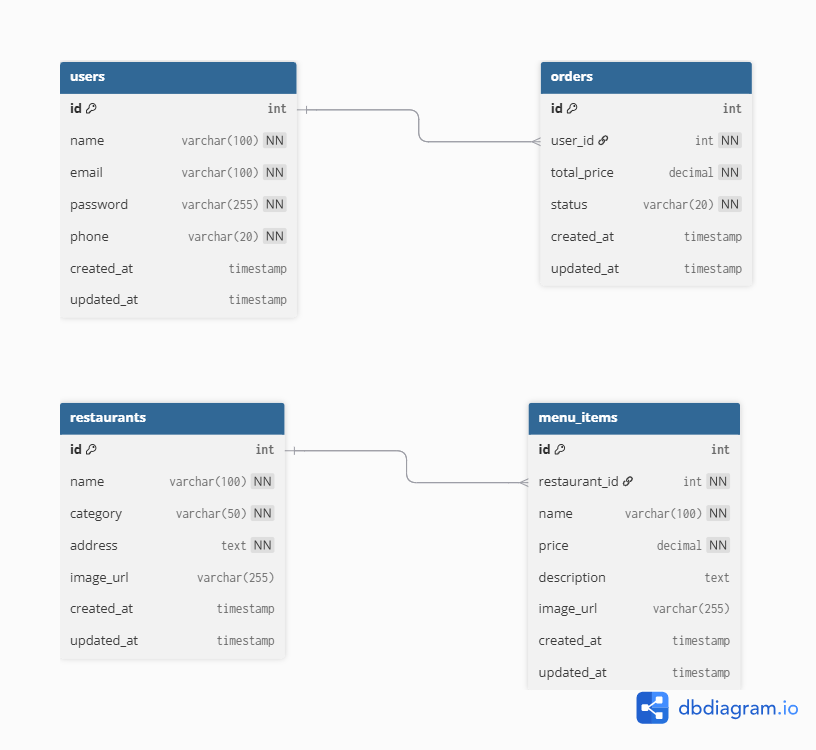

# FoodieGo API

REST API untuk aplikasi food delivery berbasis mobile, dibangun menggunakan Go dan Gin.

---

## Daftar Isi

- [Deskripsi](#deskripsi)
- [Tech Stack](#tech-stack)
- [Struktur Folder](#struktur-folder)
- [Cara Menjalankan](#cara-menjalankan)
- [Konfigurasi Environment](#konfigurasi-environment)
- [Database Diagram](#database-diagram)
- [Endpoint API](#endpoint-api)
- [Contoh Request & Response](#contoh-request--response)
- [Autentikasi](#autentikasi)
- [Status Pesanan](#status-pesanan)

---

## Deskripsi

FoodieGo API menyediakan layanan backend untuk aplikasi food delivery, mencakup autentikasi pengguna, daftar restoran, pencarian menu, dan pemesanan makanan.

---

## Tech Stack

| Kebutuhan | Package |
|-----------|---------|
| Language | Go |
| Framework | Gin |
| Database | MySQL |
| ORM | GORM |
| Autentikasi | golang-jwt/jwt |
| Enkripsi Password | golang.org/x/crypto (bcrypt) |
| Environment | godotenv |
| CORS | Gin CORS middleware |

---

## Struktur Folder

foodiego-api/
├── cmd/
│   └── main.go
├── internal/
│   ├── config/
│   │   └── database.go
│   ├── controllers/
│   │   ├── authController.go
│   │   └── restaurantController.go
│   ├── middleware/
│   │   └── auth.go
│   ├── models/
│   │   ├── user.go
│   │   └── restaurant.go
│   └── routes/
│       └── routes.go
├── docs/
│   ├── erd.png
│   └── foodiego.postman_collection.json
├── .env.example
├── .gitignore
└── go.mod

---

## Cara Menjalankan

### Prasyarat
- Go versi 1.21 atau lebih baru
- XAMPP dengan MySQL aktif

### 1. Clone repository
git clone https://github.com/Anishabibah1/FoodieGoAPI.git
cd FoodieGoAPI

### 2. Install dependencies
go mod tidy

### 3. Setup database
Buka phpMyAdmin di http://localhost/phpmyadmin lalu buat database foodiego dan jalankan query SQL dari file docs/schema.sql

### 4. Konfigurasi environment
Buat file .env di root project:
PORT=3000
DB_HOST=localhost
DB_USER=root
DB_PASSWORD=
DB_NAME=foodiego
JWT_SECRET=foodiego_secret_key_2024

### 5. Jalankan server
go run cmd/main.go

Server berjalan di http://localhost:3000

---

## Konfigurasi Environment

| Variable | Keterangan | Contoh |
|----------|-----------|--------|
| PORT | Port server | 3000 |
| DB_HOST | Host database | localhost |
| DB_USER | Username database | root |
| DB_PASSWORD | Password database | |
| DB_NAME | Nama database | foodiego |
| JWT_SECRET | Secret key JWT | foodiego_secret_key_2024 |

---

## Database Diagram

---

## API Documentation

Postman Collection tersedia di docs/foodiego.postman_collection.json

Import file tersebut ke Postman untuk mencoba semua endpoint.

---

## Endpoint API

Base URL: http://localhost:3000/api/v1

### Auth

| Method | Endpoint | Deskripsi | Auth |
|--------|----------|-----------|------|
| POST | /auth/register | Registrasi user baru | — |
| POST | /auth/login | Login dan dapatkan token | — |

### Restaurants

| Method | Endpoint | Deskripsi | Auth |
|--------|----------|-----------|------|
| GET | /restaurants | Daftar semua restoran | Token |
| GET | /restaurants/search?q=nama | Cari restoran | Token |
| GET | /restaurants/:id | Detail satu restoran | Token |

---

## Contoh Request & Response

### Register

Request:
POST /api/v1/auth/register
Content-Type: application/json

{
  "name": "Budi Santoso",
  "email": "budi@example.com",
  "password": "password123",
  "phone": "081234567890"
}

Response (201):
{
  "status": "success",
  "message": "User registered successfully."
}

---

### Login

Request:
POST /api/v1/auth/login
Content-Type: application/json

{
  "email": "budi@example.com",
  "password": "password123"
}

Response (200):
{
  "status": "success",
  "message": "Login successful.",
  "data": {
    "token": "eyJhbGciOiJIUzI1NiIsInR5cCI6IkpXVCJ9...",
    "user": {
      "id": 1,
      "name": "Budi Santoso",
      "email": "budi@example.com",
      "phone": "081234567890"
    }
  }
}

---

### Daftar Restoran

Request:
GET /api/v1/restaurants
Authorization: Bearer <token>

Response (200):
{
  "status": "success",
  "data": []
}

---

## Autentikasi

API menggunakan JWT. Setelah login, sertakan token di header setiap request:

Authorization: Bearer <token>

Token berlaku selama 24 jam. Setelah kadaluarsa, user perlu login ulang.

---

## Status Pesanan

pending - Pesanan baru dibuat
confirmed - Pesanan dikonfirmasi restoran
delivering - Pesanan sedang diantar
done - Pesanan selesai
cancelled - Pesanan dibatalkan